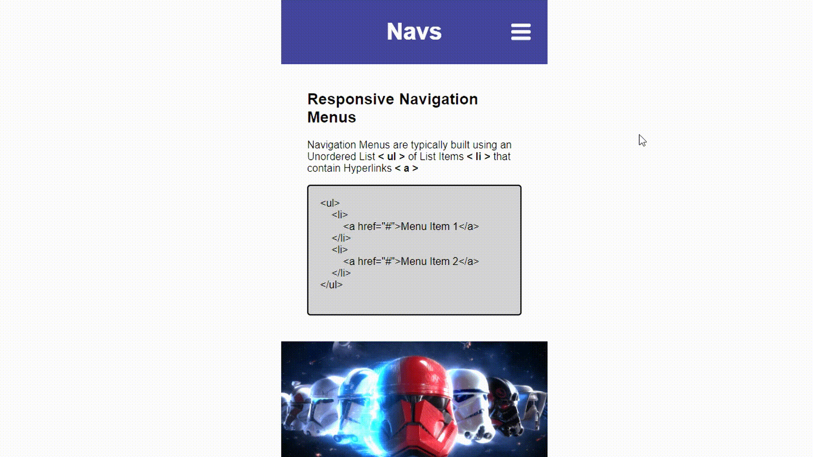

# Responsive Navigation Menus

Navigation Menus are typically built using an Unordered List < ul > of List Items < li > that contain Hyperlinks < a >

Apply Different Styles with CSS, Import Google Fonts, and Use the @media Rule to Responsively Respond to Different Device Sizes.

This is a free educational resource released under the MIT License.

Use, build, and snip from this project however you like!

